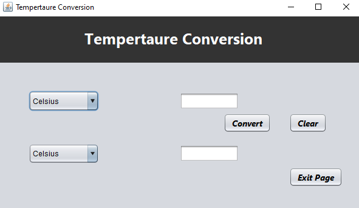
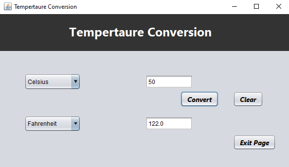

# Temperature Converter

## Description
<p align="justify">The Temperature Converter is a simple Java Swing application that allows users to convert temperatures between Celsius and Fahrenheit. This application provides a user-friendly interface with drop-down menus for selecting the input and output temperature units and fields for entering and displaying the temperature values.<p>

## Features
- Convert temperatures between Celsius and Fahrenheit.
- Clear input and output fields with a single click.
- Exit the application gracefully.

## Setup
To run this application, you will need a Java Development Kit (JDK) installed on your computer.

### Prerequisites
- Java JDK 8 or later.
- An IDE that supports Java and Swing applications (e.g., IntelliJ IDEA, Eclipse).

### Installation
1. Clone the repository or download the source code:
2. Open the project in your IDE.
3. Build the project to resolve dependencies and compile.

### Running the Application
To run the application from your IDE:
1. Navigate to the `Temperature_converter` class.
2. Run the `main` method.

Alternatively, you can compile and run the application using the command line:
```bash
javac Your_filename.java
java Your_filename
```

## Usage
- Select the desired input unit (Celsius or Fahrenheit) from the first drop-down menu.
- Enter the temperature value you wish to convert in the input field.
- Select the desired output unit from the second drop-down menu.
- Click the "Convert" button to see the converted temperature in the output field.
- Use the "Clear" button to reset input and output fields.
- Click "Exit Page" to close the application.

## Contributing
Contributions to this project are welcome. Please fork the repository and submit a pull request with your changes.

### Output Screen

- Before Conversion
#### Before conversion the Temperature
  

- After Conversion
#### AFTER Conversion the temperature
   